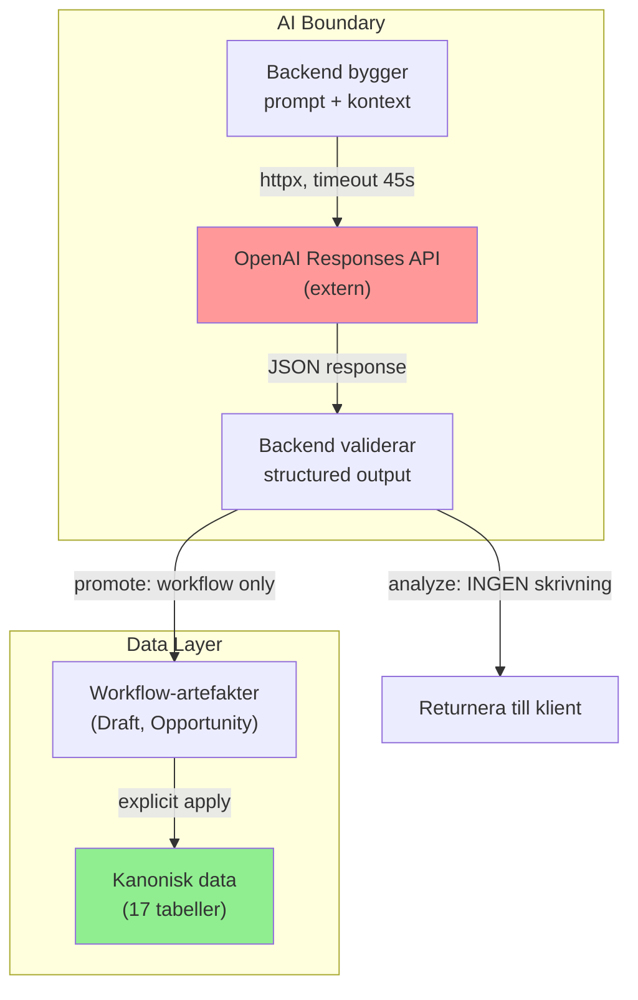

# AI-kontrakt

Dokumenterar var AI får och inte får vara, hur prompts är uppbyggda,
och säkerhetsgränser för AI-interaktion.
Last verified against code: 2026-04-27.

## AI-ytor i systemet

Systemet har exakt **två** AI-ytor, båda backend-ägda:

### 1. Hushållsassistent (`POST /households/{id}/assistant/respond`)
- **Funktion**: Analys av hushållsdata + strukturerade write-intents för användargranskning
- **Input**: Fri text-prompt (svenska)
- **Kontext**: Kompakt read model av aktiv sammanfattning + aktiva listor för återkommande kostnader, abonnemang och lån (inkl. `per_person`-uppdelning) + separat `review_queue`. `paused`/avslutade poster och inaktiva personers personbundna fakta exkluderas.
- **Output**: Fri text (svar), följdfrågor, valfri `write_intent`, provider/model/usage-metadata
- **Skrivning i respond**: INGEN. Svaret sparas bara som chatthistorik.
- **Kanonisk skrivning**: Endast via separat `POST /households/{id}/assistant/apply_intent`, och bara om requesten pekar på ett sparat assistantsvar med matchande `write_intent`.
- **Konversationsminne**: Aktiv tråd och meddelanden lagras i SQLite.
- **Viktigt**: Assistenten vet skillnad på aktiv och inaktiv data. Den kan separera individuellt från gemensamt.
- **Specialfall**: Om prompten innehåller `BEGIN_ECON_IMPORT_PACKAGE_V1 ... END_ECON_IMPORT_PACKAGE_V1` växlar samma route till importinterceptorn och skapar bara workflow-artefakter, aldrig kanonisk data direkt.
- **Följdfrågor**: Pending importfrågor hanteras bara när användaren svarar utan frågetecken; vanliga analysfrågor fortsätter till assistentmodellen.

### Assistentens apply-gateway (`POST /households/{id}/assistant/apply_intent`)
- **Input**: Intent, data och obligatoriskt `source_message_id`.
- **Validering**: Backend laddar det sparade assistantsvaret, kontrollerar att intent, target och data matchar lagrad `write_intent`, och stoppar apply om `missing_fields` finns, obligatoriska ekonomifält saknas eller samma `source_message_id` redan har applicerats.
- **Skrivning**: Skapar/uppdaterar/avslutar bara de entity-typer som explicit stöds av backend.
- **Audit/UX**: Systembekräftelse sparas som `chat_messages` med `source_message_id`, intent och resultat.

### 2. Data-In AI (`POST /households/{id}/ingest_ai/analyze` + `promote`)
- **Funktion**: Klassificera och extrahera strukturerad data ur råtext
- **Input**: Råtext, Excel (.xlsx), PDF, OCR-extraherat
- **Pre-processing**: Normalisering, hint-detektering. Stora underlag `chunkas` förlåtande och alla chunkar analyseras. Dokumentnivåns klassificering och sammanfattning byggs sedan av hela chunkmängden, inte bara sista delen.
- **Failover**: Använder begränsad automatisk retry (1 extra försök) via backend-wrapper vid provider-/requestfel.
- **Output**: Klassificering (1 av 9 typer) + validerade suggestions
- **Skrivning vid analyze**: INGEN
- **Skrivning vid promote**: `Document` + `ExtractionDraft`-rader (workflow-artefakter)
- **Kanonisk skrivning**: Först vid separat explicit `POST /extraction_drafts/{id}/apply`

## Promptarkitektur

### Assistant-prompt
```
System: Du är en hushållsekonomi-rådgivare. Hushållsdata presenteras som kompakt JSON.
        Svara på svenska. Var saklig och konkret.
        Skilj alltid på verifierad kanonisk data och obekräftad review_queue.
User:   [Kompakt household read model som JSON]
        Fråga: [Användarens prompt]
```

### Ingest-prompt
```
System: Du ska klassificera och extrahera ekonomisk data ur råtext.
        Använd dessa regler:
        - 9 klassificeringstyper med definitioner
        - Fältguider med tillåtna enum-värden
        - confidence-skala (0-1)
        - confirmed_fields vs uncertain_fields
        - Konvertera otillåtna frekvenser till näraste tillåtna
User:   [Normaliserad råtext, ev. med source_channel hint]
```

### Structured output
- Responses API med JSON schema för guaranteerat strukturerat output
- Backend validerar varje suggestion mot Pydantic create-scheman
- Ogiltiga enum-värden → `validation_status: "invalid"` (men returneras ändå)

## Tool contracts (nuläge)

AI har idag **inga tools**. Alla anrop är enkla text-in/structured-out.

## Närliggande icke-AI-yta

- `POST /households/{id}/assistant/import_files` är **inte** en AI-yta. Den stage:ar bara riktiga filer in i `Document`-tabellen och hänvisar användaren till Dokument-flödet för analys/review/apply.
- Frontendens befintliga assistentchatt kan nu både ta fri text och bifogade råfiler (`.xls`, `.xlsx`, PDF, text). Själva review/apply sker fortfarande i backendens dokumentworkflow.
- `GET /households/{id}/analysis` är deterministiskt och innehåller `advisory_analysis`. I v1 är extern deal-jämförelse en stub (`external_data_used=false`), så inga marknadsuppgifter blandas in i fakta.

Framtida tool-kontrakt bör följa:
1. Scopa alltid till ett hushåll
2. Validera output mot strikta scheman
3. Aldrig ge AI direkt databasaccess
4. Returnera metadata (provider, model, tokens)

## Säkerhetsgränser



### Hårda regler
1. **AI skriver aldrig direkt till kanoniska tabeller** — assistant `respond` skriver bara chattmeddelanden; kanonisk ändring kräver separat apply med sparad källa
2. **Analyze skriver ingenting** — returnerar bara suggestions till klienten
3. **Promote skapar bara Document + ExtractionDraft** — inte kanonisk data
4. **Apply är separat, explicit och one-shot** — användaren måste aktivt klicka och requesten måste peka på ett sparat, ej redan applicerat `write_intent`
5. **Saknar AI API-nyckel → 503** — aldrig fejkade fallback-svar
6. **AI-fel → 502** — provider error exponeras i detail
7. **Timeout: 45 sekunder** — konfigurerbart via env
8. **Osäker boendedata får inte maskeras som privat konsumtion** — huskonto/boende ska vara separat hushållspost eller explicit unresolved state

## Klassificeringstyper (9 st)

| Typ | Beskrivning |
|---|---|
| `subscription_contract` | Abonnemang, avtal |
| `invoice` | Faktura |
| `recurring_cost_candidate` | Trolig återkommande kostnad |
| `transfer_or_saving_candidate` | Trolig överföring/sparande |
| `bank_row_batch` | Kontoutdrag med flera rader |
| `insurance_policy` | Försäkring |
| `loan_or_credit` | Lån/kredit |
| `financial_note` | Generell finansiell anteckning |
| `unclear` | Oklart underlag |

## Token-förbrukning (verifierad)

| Anropstyp | Typisk tokenförbrukning |
|---|---|
| Assistant-analys | ~650-1000 tokens |
| Enkel ingest (1 dokument) | ~1600-1900 tokens |
| Bank-paste batch | ~2400-2500 tokens |

## Modell-konfiguration

| Env-variabel | Default | Användning |
|---|---|---|
| `OPENAI_MODEL` | `gpt-5.4` | Fallback för alla AI-flöden |
| `OPENAI_ANALYSIS_MODEL` | (ej satt) | Override för assistant |
| `OPENAI_INGEST_MODEL` | (ej satt) | Override för ingest |
| `ECON_AI_MODEL_ROUTING_ENABLED` | `true` | Aktiverar explicit assistant-routing |
| `ECON_AI_DEFAULT_MODEL` | (ej satt) | Modell för vanlig assistant-chat |
| `ECON_AI_STRUCTURED_MODEL` | (ej satt) | Modell för structured write-intent/missing-info |
| `ECON_AI_DEEP_ANALYSIS_MODEL` | (ej satt) | Modell för explicit djupanalys |
| `ECON_AI_FALLBACK_MODEL` | (ej satt) | Plain-text fallbackmodell vid structured schema/providerfel |
| `OPENAI_BASE_URL` | (ej satt) | OpenAI-kompatibel API-URL |
| `OPENAI_TIMEOUT_SECONDS` | 45 | Timeout per anrop |

## Assistant-routingpolicy

Assistanten väljer route deterministiskt med keywordregler (ingen LLM-baserad router i v1):

1. `assistant_chat`
   - vanlig fråga utan tydlig write/deep-signal
   - textläge, `allow_write_intent=false`
2. `assistant_write_intent`
   - prompt med tydlig create/update/delete-signal och tillräcklig information
   - structured-läge, `allow_write_intent=true`
3. `assistant_missing_info`
   - write-signal men saknade kärnfält
   - structured-läge, `allow_write_intent=true` med `missing_fields/questions`
4. `deep_analysis`
   - explicit djupanalys/helhetsgranskning/motsägelsejakt
   - textläge, `allow_write_intent=false`
5. `fallback_plain_text`
   - endast när structured schema/providerfel uppstår
   - textläge, `allow_write_intent=false`

Säkerhetsgränsen ändras inte av route-val: `respond` skriver aldrig kanonisk data.

## Framtida AI-modellbyte

Att byta AI-provider kräver idag ändringar i `app/ai_services.py`.
En provider-abstraktion finns inte men kan läggas till utan att
påverka resten av systemet, tack vare att:
- AI-lagret är isolerat i en fil
- Alla anrop går via backend (aldrig direkt från frontend)
- Output valideras mot Pydantic-scheman oberoende av provider
- Inga AI-specifika datamodeller — allt lagras som JSON i workflow-artefakter

## Vad AI INTE får bli

- Inte en tyst skrivväg till kanonisk data
- Inte en direkt-koppling från frontend till extern API
- Inte en ersättning för deterministisk matematik
- Inte en okontrollerad chatbot med fri access till allt
- Inte en autonom agent som fattar ekonomiska beslut
