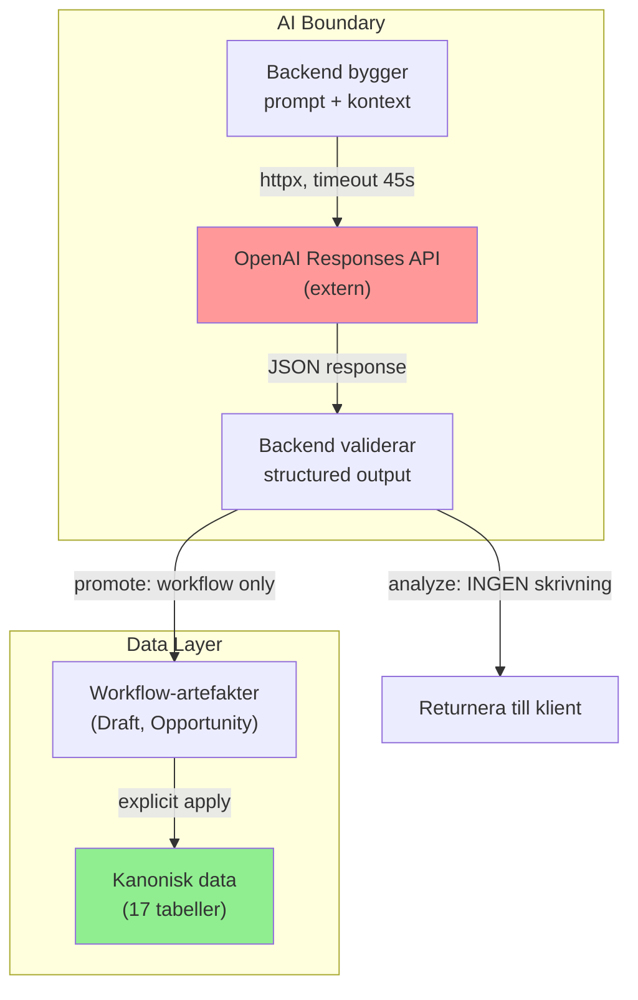

# AI-kontrakt

Dokumenterar var AI får och inte får vara, hur prompts är uppbyggda,
och säkerhetsgränser för AI-interaktion.
Last verified against code: 2026-04-10.

## AI-ytor i systemet

Systemet har exakt **två** AI-ytor, båda backend-ägda:

### 1. Hushållsassistent (`POST /households/{id}/assistant/respond`)
- **Funktion**: Read-only analys av hushållsdata
- **Input**: Fri text-prompt (svenska)
- **Kontext**: Kompakt read model av hushållsdata (beräknad av backend)
- **Output**: Fri text (svar) + provider/model/usage-metadata
- **Skrivning**: INGEN. Helt read-only mot alla tabeller
- **Saknar idag**: Konversationsminne (bara enskilda frågor)

### 2. Data-In AI (`POST /households/{id}/ingest_ai/analyze` + `promote`)
- **Funktion**: Klassificera och extrahera strukturerad data ur råtext
- **Input**: Råtext (klistrat, PDF, OCR-extraherat)
- **Pre-processing**: Normalisering, hint-detektering, truncering vid 6000 tecken
- **Output**: Klassificering (1 av 9 typer) + validerade suggestions
- **Skrivning vid analyze**: INGEN
- **Skrivning vid promote**: `Document` + `ExtractionDraft`-rader (workflow-artefakter)
- **Kanonisk skrivning**: Först vid separat explicit `POST /extraction_drafts/{id}/apply`

## Promptarkitektur

### Assistant-prompt
```
System: Du är en hushållsekonomi-rådgivare. Hushållsdata presenteras som kompakt JSON.
        Svara på svenska. Var saklig och konkret.
User:   [Kompakt household read model som JSON]
        Fråga: [Användarens prompt]
```

### Ingest-prompt
```
System: Du ska klassificera och extrahera ekonomisk data ur råtext.
        Använd dessa regler:
        - 9 klassificeringstyper med definitioner
        - Fältguider med tillåtna enum-värden
        - confidence-skala (0-1)
        - confirmed_fields vs uncertain_fields
        - Konvertera otillåtna frekvenser till näraste tillåtna
User:   [Normaliserad råtext, ev. med source_channel hint]
```

### Structured output
- Responses API med JSON schema för guaranteerat strukturerat output
- Backend validerar varje suggestion mot Pydantic create-scheman
- Ogiltiga enum-värden → `validation_status: "invalid"` (men returneras ändå)

## Tool contracts (nuläge)

AI har idag **inga tools**. Alla anrop är enkla text-in/structured-out.

Framtida tool-kontrakt bör följa:
1. Scopa alltid till ett hushåll
2. Validera output mot strikta scheman
3. Aldrig ge AI direkt databasaccess
4. Returnera metadata (provider, model, tokens)

## Säkerhetsgränser



### Hårda regler
1. **AI skriver aldrig direkt till kanoniska tabeller** — alltid via workflow-artefakter
2. **Analyze skriver ingenting** — returnerar bara suggestions till klienten
3. **Promote skapar bara Document + ExtractionDraft** — inte kanonisk data
4. **Apply är separat och explicit** — användaren måste aktivt klicka
5. **Saknar AI API-nyckel → 503** — aldrig fejkade fallback-svar
6. **AI-fel → 502** — provider error exponeras i detail
7. **Timeout: 45 sekunder** — konfigurerbart via env

## Klassificeringstyper (9 st)

| Typ | Beskrivning |
|---|---|
| `subscription_contract` | Abonnemang, avtal |
| `invoice` | Faktura |
| `recurring_cost_candidate` | Trolig återkommande kostnad |
| `transfer_or_saving_candidate` | Trolig överföring/sparande |
| `bank_row_batch` | Kontoutdrag med flera rader |
| `insurance_policy` | Försäkring |
| `loan_or_credit` | Lån/kredit |
| `financial_note` | Generell finansiell anteckning |
| `unclear` | Oklart underlag |

## Token-förbrukning (verifierad)

| Anropstyp | Typisk tokenförbrukning |
|---|---|
| Assistant-analys | ~650-1000 tokens |
| Enkel ingest (1 dokument) | ~1600-1900 tokens |
| Bank-paste batch | ~2400-2500 tokens |

## Modell-konfiguration

| Env-variabel | Default | Användning |
|---|---|---|
| `OPENAI_MODEL` | `gpt-5.4` | Fallback för alla AI-flöden |
| `OPENAI_ANALYSIS_MODEL` | (ej satt) | Override för assistant |
| `OPENAI_INGEST_MODEL` | (ej satt) | Override för ingest |
| `OPENAI_BASE_URL` | (ej satt) | OpenAI-kompatibel API-URL |
| `OPENAI_TIMEOUT_SECONDS` | 45 | Timeout per anrop |

## Framtida AI-modellbyte

Att byta AI-provider kräver idag ändringar i `app/ai_services.py`.
En provider-abstraktion finns inte men kan läggas till utan att
påverka resten av systemet, tack vare att:
- AI-lagret är isolerat i en fil
- Alla anrop går via backend (aldrig direkt från frontend)
- Output valideras mot Pydantic-scheman oberoende av provider
- Inga AI-specifika datamodeller — allt lagras som JSON i workflow-artefakter

## Vad AI INTE får bli

- Inte en tyst skrivväg till kanonisk data
- Inte en direkt-koppling från frontend till extern API
- Inte en ersättning för deterministisk matematik
- Inte en okontrollerad chatbot med fri access till allt
- Inte en autonom agent som fattar ekonomiska beslut
