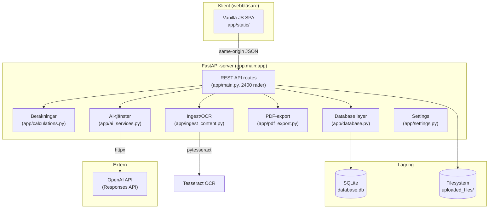
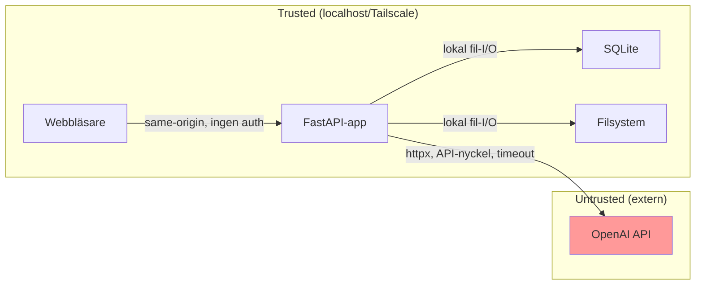

# Arkitektur

Teknisk arkitektur som den faktiskt fungerar idag.
Last verified against code: 2026-04-10.

## Systemöversikt



## Komponentöversikt

### Backend

| Fil | Ansvar | Storlek |
|---|---|---|
| `app/main.py` | FastAPI-app, alla route-definitioner, startup, filuppladdning, workflow-logik | 2420 rader |
| `app/models.py` | SQLAlchemy ORM-modeller (17 tabeller) | 463 rader |
| `app/schemas.py` | Pydantic v1 request/response-scheman | 35KB |
| `app/calculations.py` | Deterministisk sammanfattning, boende, scenario, hjälpmatematik | 15KB |
| `app/ai_services.py` | OpenAI-anrop, kontextbygge, ingest-validering, draft-promotion | 46KB |
| `app/ingest_content.py` | Textextraktion, OCR, PDF-parsning, normalisering | 10KB |
| `app/pdf_export.py` | Bank-PDF-generering via reportlab | 14KB |
| `app/database.py` | SQLAlchemy engine, session-factory, auto-bootstrap | 1.2KB |
| `app/settings.py` | Pydantic BaseSettings med env-variabler | 2.1KB |

### Frontend

| Fil | Ansvar | Storlek |
|---|---|---|
| `app/static/index.html` | SPA-skal med sidebar och topbar | 1.4KB |
| `app/static/app.js` | All SPA-logik: routing, rendering, formulär, API-anrop | 233KB |
| `app/static/styles.css` | Visuellt språk, layout, responsivitet | 17KB |

### Drift

| Fil | Ansvar |
|---|---|
| `scripts/start_app.sh` | Lokal startväg: venv, deps, alembic, port-fallback, Tailscale |
| `Dockerfile` | Container-runtime (inkluderar Tesseract för OCR) |
| `docker-compose.yml` | Lokal containerorkestrering |
| `alembic/` | Migrationsmiljö + 4 revisioner |

## Request/Data Flow

### Vanlig CRUD-begäran
```
Webbläsare → GET/POST/PUT/DELETE /entity → main.py route → SQLAlchemy → SQLite → JSON response
```

### Data-In AI-flöde
```
1. Klient skickar råtext → POST /households/{id}/ingest_ai/analyze
2. ingest_content.py: normalisera + hint-detektering + ev. OCR
3. ai_services.py: bygg prompt → OpenAI Responses API
4. ai_services.py: validera varje suggestion mot Pydantic-scheman
5. Returnera klassificering + validerade förslag (INGEN DB-skrivning)
6. Klient granskar → POST /households/{id}/ingest_ai/promote
7. main.py: skapa Document + ExtractionDraft-rader (workflow-artefakter)
8. Klient väljer → POST /extraction_drafts/{id}/apply  
9. main.py: skapa kanonisk entitet från proposed_json
```

### Sammanfattningsflöde
```
1. GET /households/{id}/summary
2. calculations.py: ladda alla hushållsposter
3. Normalisera till månads-/årsbelopp
4. Beräkna totaler + risk signals
5. Returnera deterministisk JSON
```

## Trust boundaries



**Säkerhetsmodell**: Ingen autentisering. Trust boundary = nätverksnivå (Tailscale VPN eller localhost).

## Extension points

1. **Provider-abstraktion**: `ai_services.py` kan abstraheras bakom ett interface för att stödja andra LLM-providers
2. **Router-uppdelning**: `main.py` kan brytas ut till separata FastAPI-routers per domänområde
3. **Bakgrundsjobb**: FastAPI/Celery eller liknande kan läggas till för påminnelser
4. **Auth-lager**: Middleware eller dependency injection i FastAPI
5. **Extern lagring**: `database.py` stödjer redan `DATABASE_URL` för PostgreSQL

## Arkitektonisk skuld

| Skuld | Prioritet | Kommentar |
|---|---|---|
| `main.py` är 2420 rader | Medel | Bör brytas ut till routers, men fungerar |
| `app.js` är 233KB | Medel | Innehåller legacy + aktiva handlers |
| Direkt OpenAI-koppling | Låg | Fungerar, men provider-byte kräver kodändring |
| `AUTO_CREATE_SCHEMA=true` default | Låg | Kan maskera migrationsproblem |
| Ingen strukturerad loggning | Låg | Uvicorn stdout räcker för hushållsbruk |
