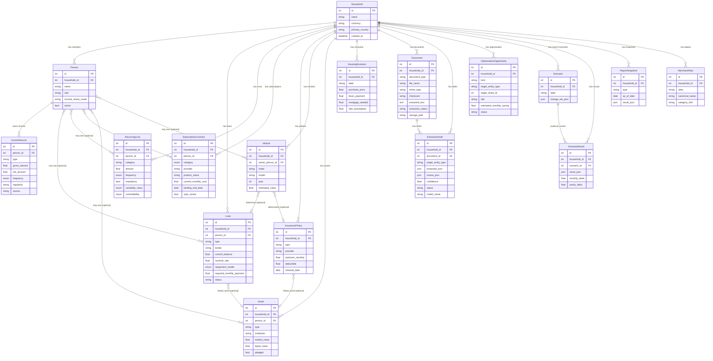

# ER-diagram

Datamodellen som den faktiskt finns implementerad i `app/models.py`.
Last verified against code: 2026-04-10.

## Mermaid ER-diagram

## Modell-lager

### Kärnlager (Household Core)
- `Household` — toppnivåcontainer
- `Person` — hushållsmedlem, äger inkomstkällor

### Ekonomiska poster (Income, Liability, Cost, Asset)
- `IncomeSource` — inkomst kopplad till person
- `Loan` — skuld/lån med amorteringsmodell
- `RecurringCost` — återkommande kostnad (mat, transport, etc.)
- `SubscriptionContract` — avtal (mobil, bredband, streaming)
- `InsurancePolicy` — försäkring
- `Vehicle` — fordon med driftskostnader
- `Asset` — tillgång (konto, sparande, fastighet)

### Planering och utvärdering
- `HousingScenario` — boendekalkyl
- `Scenario` — vad-om-analys med JSON-ändringar
- `ScenarioResult` — resultat av scenariokörning
- `ReportSnapshot` — fryst sammanfattning vid tidpunkt

### Dokument och AI-arbetsflöde
- `Document` — dokumentmetadata + lagringssökväg
- `ExtractionDraft` — AI-förslag, inväntar granskning/applicering
- `OptimizationOpportunity` — heuristisk förbättringsmöjlighet
- `MerchantAlias` — per-hushåll alias → kanoniskt handelsnamn

## Index och nycklar

- Alla modeller har `id` som primärnyckel (autoincrement integer)
- Foreign keys med `ondelete=CASCADE` för household → barnentiteter
- Foreign keys med `ondelete=SET NULL` för valfria relationer (person, asset, vehicle)
- Inget explicit unikt constraint på MerchantAlias (alias per household)

## Enums i modellen

| Enum | Värden |
|---|---|
| `IncomeFrequency` | monthly, yearly, weekly, biweekly, daily |
| `LoanRepaymentModel` | annuity, fixed_amortization, interest_only, manual |
| `VariabilityClass` | fixed, semi_fixed, variable |
| `Controllability` | locked, negotiable, reducible, discretionary |
| `SubscriptionCategory` | mobile, broadband, electricity, streaming, gym, alarm, software, insurance, membership, other |
